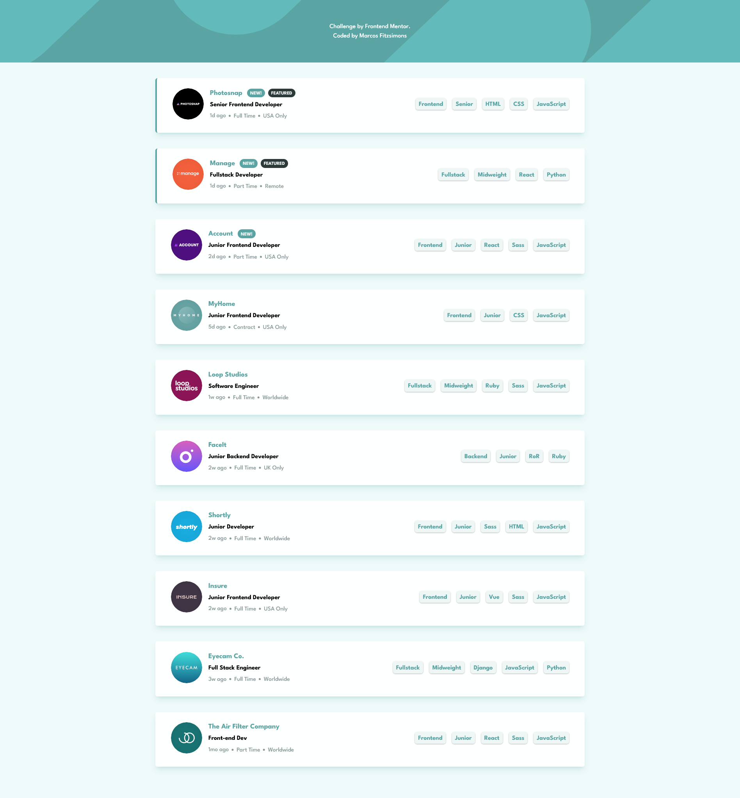

# Frontend Mentor - Job listings with filtering solution

This is a solution to the [Job listings with filtering challenge on Frontend Mentor](https://www.frontendmentor.io/challenges/job-listings-with-filtering-ivstIPCt). Frontend Mentor challenges help you improve your coding skills by building realistic projects.

## Table of contents

- [Overview](#overview)
  - [The challenge](#the-challenge)
  - [Screenshot](#screenshot)
  - [Links](#links)
  - [Built with](#built-with)
- [Author](#author)

## Overview

### The challenge

Users should be able to:

- View the optimal layout for the site depending on their device's screen size
- See hover states for all interactive elements on the page
- Filter job listings based on the categories

### Screenshot

### Links

- Solution URL: [Here](https://www.frontendmentor.io/solutions/job-listings-with-filtering-react-and-tailwindcss-XjuFvzHECq)
- Live Site URL: [Here](https://job-listings-w-filtering.vercel.app/)

### Built with

- Semantic HTML5 markup
- CSS custom properties
- Flexbox
- Mobile-first workflow
- [React](https://reactjs.org/) - JS library
- [TailwindCSS](https://tailwindcss.com/) - For styles

## Author

- Website - [Marcos Valentín Fitzsimons](https://marcosfitzsimons-portfolio.vercel.app/)
- Frontend Mentor - [@Marcosfitzsimons](https://www.frontendmentor.io/profile/Marcosfitzsimons)
